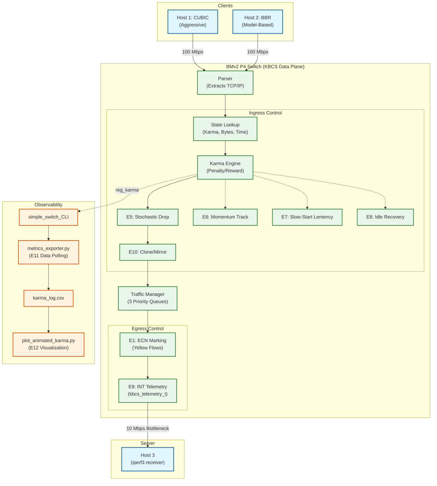

# KBCS System Architecture
Below is the system architecture of the enhanced Karma-Based Congestion Signaling (KBCS) Phase 3 platform, outlining data plane mechanics and external observability features.

### Module Descriptions
- **Karma Engine:** Computes proportional penalties dynamically based on throughput.
- **E5 (Stochastic Drop):** Flattens TCP synchronization crashes using random drops.
- **E6 (Momentum):** Punishes rapidly decaying karmas.
- **E7 (Slow-Start Leniency):** Grants 20-packet immunity for TCP handshakes.
- **E8 (Idle Recovery):** Escapes starvation deadlocks post-timeout.
- **E9 (INT):** Appends local metadata securely to cloned egress packets.
- **E11 + E12 (Telemetry Export):** Automates the visual rendering of complex queuing battles across different bottlenecks.
